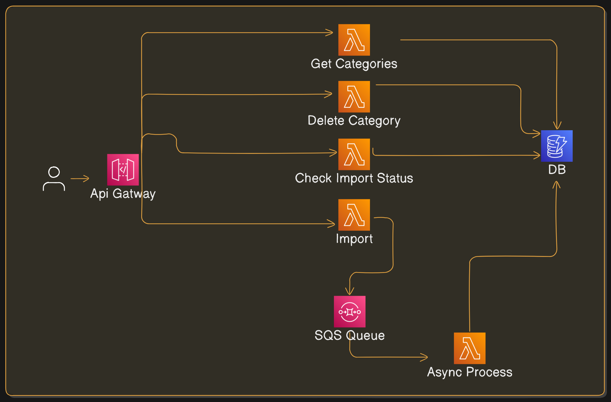

## Overview

This project is a **serverless API** built using **AWS Lambda, API Gateway, SQS, and DynamoDB** to manage WooCommerce product categories. It provides the following functionalities:

- **Import product categories asynchronously** from a WooCommerce site.
- **Retrieve all stored categories** from DynamoDB.
- **Delete a category by ID**.
- **Check the status of an ongoing import process**.

## Features

- **Asynchronous Processing** (Uses AWS SQS for background tasks)
- **Fully Serverless** (Managed by AWS Lambda & API Gateway)
- **Fast NoSQL Storage** (Uses AWS DynamoDB)
- **Secure & Scalable**
- **Easy Deployment with AWS SAM**

## Deployment Guide

### Prerequisites

- **Node.js 18+**
- **pnpm (preffered)**
- **AWS CLI** configured (`run aws configure after installation`)
- **AWS SAM CLI** installed ([Install Guide](https://docs.aws.amazon.com/serverless-application-model/latest/developerguide/install-sam-cli.html))

### Steps

1. **Clone the Repository**
   ```bash
   git clone github.com/amjed-98/syncme-task
   cd syncme-task
   ```
2. **Install Dependencies**
   ```bash
   pnpm install
   ```
3. **Build and Deploy to the cloud**
   ```bash
   pnpm build:deploy
   ```
4. **Get the API Gateway URL from deployment logs**.

## Architecture



[](https://app.getpostman.com/run-collection/22871956-79dcb30d-c13e-4fa8-a482-6f4a930a5e9e?action=collection%2Ffork&source=rip_markdown&collection-url=entityId%3D22871956-79dcb30d-c13e-4fa8-a482-6f4a930a5e9e%26entityType%3Dcollection%26workspaceId%3D15013a68-0290-4731-bf05-294e304b14e1#?env%5Bsyncme-prod%5D=W3sia2V5IjoiYXBpLXVybCIsInZhbHVlIjoiaHR0cHM6Ly83c3ZsdzBkajUyLmV4ZWN1dGUtYXBpLnVzLWVhc3QtMS5hbWF6b25hd3MuY29tL1Byb2QiLCJlbmFibGVkIjp0cnVlLCJ0eXBlIjoiZGVmYXVsdCIsInNlc3Npb25WYWx1ZSI6Imh0dHBzOi8vN3N2bHcwZGo1Mi5leGVjdXRlLWFwaS51cy1lYXN0LTEuYW1hem9uYXdzLmNvbS9Qcm9kIiwiY29tcGxldGVTZXNzaW9uVmFsdWUiOiJodHRwczovLzdzdmx3MGRqNTIuZXhlY3V0ZS1hcGkudXMtZWFzdC0xLmFtYXpvbmF3cy5jb20vUHJvZCIsInNlc3Npb25JbmRleCI6MH1d)

## API Endpoints

### 1️⃣ Import Categories (Async)

**Request:**

```bash
curl -X POST https://your-api-gatway-url/import
```

**Response:**

```json
{
  "success": true,
  "message": "Import process started"
}
```

### 4️⃣ Check Import Status

**Request:**

```bash
curl -X GET https://your-api-gateway-url/status
```

**Response:**

```json
{
  "success": true,
  "import_status": "pending" | "in-progress" | "completed" | "failed"
}
```

### 2️⃣ Retrieve All Categories

**Request:**

```bash
curl -X GET https://your-api-gateway-url/categories
```

**Response:**

```json
{
  "success": true,
  "data": [
    {
      "Description": "",
      "CategoryID": "92",
      "ParentID": "90",
      "Name": "Business Laptop",
      "Display": "default"
    }
  ]
}
```

### 3️⃣ Delete a Category

**Request:**

```bash
curl -X DELETE https://your-api-gateway-url/categories/15
```

**Response:**

```json
{
  "success": true,
  "message": "Category 15 deleted successfully"
}
```

## License

This project is licensed under the **MIT License**.

## Contributors

👨‍💻 **Amjad Yahia**\
📧 Email: [amjadyahia.dev@gmail.com](mailto:amjadyahia.dev@gmail.com)\
